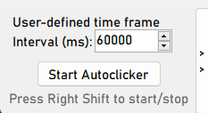
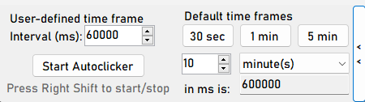

An autoclicker program designed for desktops, which was created with help of a [tutorial](https://youtu.be/tKDNFzJgcrU?si=wvqpE6fMYh2w_hp7). 



This program has been expanded to include user-defined and predefined times. User-defined times must be specified in milliseconds. To assist with this, there is a converter that converts minutes and seconds into milliseconds.
There are three predefined times to choose from. Once selected, the clicker will adjust accordingly and use this time to click. In the settings you're able to change the key to start and stop the clicker automatically without having to focus on the program.

---

## Functions

- Three predefined click times to choose from
- User-defined click time
- Autoclicker that adapts to the selected time
- Millisecond calculator to help with the user defined click time
- Key that will start/stop the program
- Setting to change the key

---

## Installation & Execution

1. Clone repo:
   ```bash
   git clone https://github.com/Pancham674/Autoclicker.git
   cd Autoclicker

2. Start program
    ```bash
    dotnet build
    bin\Debug\net10.0-windows\AutoClicker.exe
